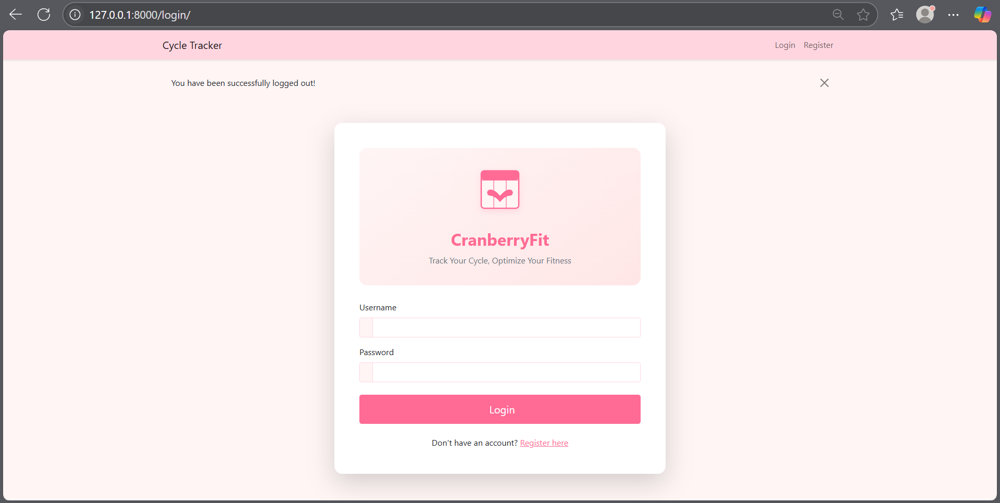
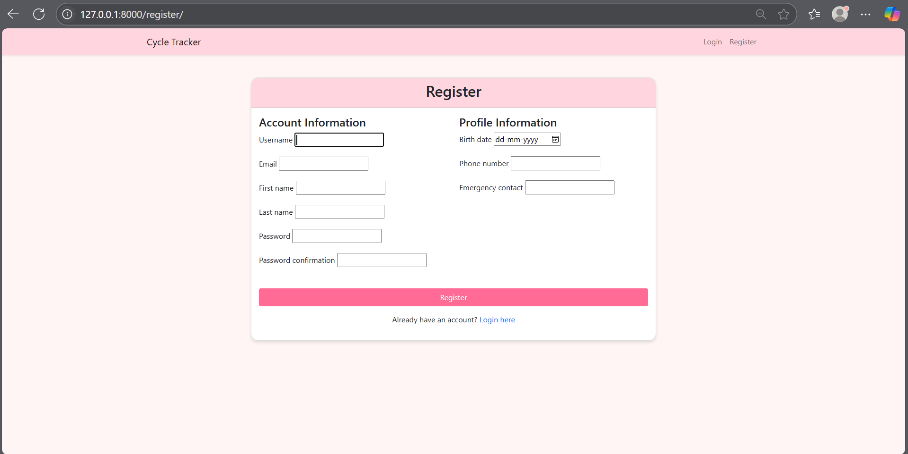
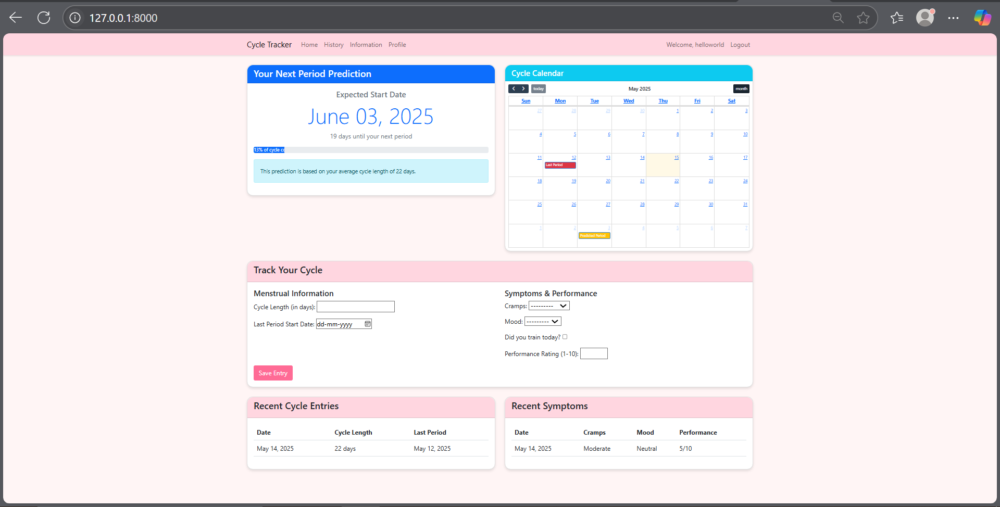
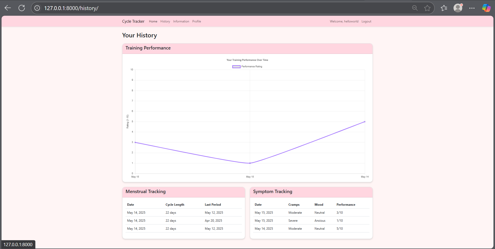
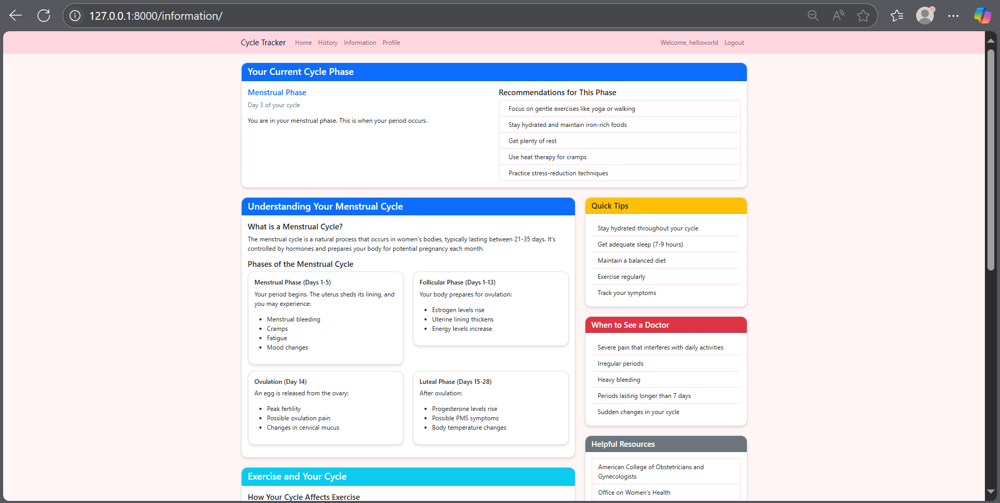

# CranberryFit - Period Cycle Tracker

A comprehensive period tracking application that helps women monitor their menstrual cycle, track symptoms, and optimize their fitness routine based on their cycle phase.

## Features

- Period tracking and prediction
- Symptom tracking
- Exercise performance monitoring
- Cycle phase information
- Educational resources about menstrual health
- Common medical conditions information
- Interactive symptom checker

## Tech Stack

- Python 3.x
- Django 4.2
- Bootstrap 5
- Chart.js
- FullCalendar.js
- SQLite (development)

## Installation

1. Clone the repository:
```bash
git clone https://github.com/yourusername/PeriodCycleTracker-CranberryFit.git
cd PeriodCycleTracker-CranberryFit
```

2. Create and activate a virtual environment:
```bash
python -m venv venv
source venv/bin/activate  # On Windows: venv\Scripts\activate
```

3. Install dependencies:
```bash
pip install -r requirements.txt
```

4. Run migrations:
```bash
python manage.py migrate
```

5. Create a superuser:
```bash
python manage.py createsuperuser
```

6. Run the development server:
```bash
python manage.py runserver
```

## User Registration

- After starting the server, visit `http://localhost:8000` in your browser.
- To use the default credentials (username: `helloworld`, password: `pass123word`), first create a superuser:
  ```bash
  python manage.py createsuperuser
  ```
  When prompted, enter:
  - Username: `helloworld`
  - Email: `helloworld@example.com`
  - Password: `pass123word`
- Alternatively, you can click on the 'Register' or 'Sign Up' link to create a new user account.
- Log in with your credentials to start using all features of the app.

## Usage

1. Register a new account using the sign-up page (no admin access needed)
2. Log in with your new credentials
3. Start tracking your period by adding your first period date
4. Use the calendar to view predictions and track symptoms
5. Monitor your exercise performance in relation to your cycle
6. Access educational resources and medical information

## Contributing

1. Fork the repository
2. Create a new branch for your feature
3. Make your changes
4. Submit a pull request

## License

This project is licensed under the MIT License - see the LICENSE file for details.

## Acknowledgments

- Icons by Font Awesome
- Charts by Chart.js
- Calendar by FullCalendar.js

---

## 🚀 Features

### 📝 Cycle Tracking Form

Users can input and track the following:

- **Cycle Length**: Number of days in the user's menstrual cycle.
- **Last Period Start Date**: Used to calculate the current phase of the cycle.
- **Symptoms**: Track common symptoms such as cramps, mood swings, and fatigue.
  
✨ The form dynamically updates with **personalized insights** based on user input.

---

### 🎨 Styling with CSS

- Soft **light pink background** for a calm and appealing look.
- A **centered form** with rounded corners, padding, and drop shadows for a modern aesthetic.
- **Insights** are highlighted in colorful, styled list items for enhanced readability.

---

## 💡 Use Cases

- **Health and Fitness Tracking**: Monitor patterns that can optimize exercise, diet, and wellness routines.
- **Medical Support**: Detect irregularities that may be relevant for consultations with healthcare professionals.
- **Wellness Insights**: Understand how lifestyle factors like hydration and sleep influence the menstrual cycle and well-being.

---

## 🛠️ Tech Stack

- **Backend**: Django (Python)
- **Frontend**: HTML5, CSS3
- **Database**: SQLite (default with Django, easily swappable)

---

---

## Screenshot images of website
**Login Page**



**Registration Page**



**Home Page**



**History Page**



**Information Page**


---

## ⚙️ Getting Started

1. **Clone the repository**  
   ```bash
   git clone https://github.com/your-username/cycle-tracker.git
   cd cycle-tracker
